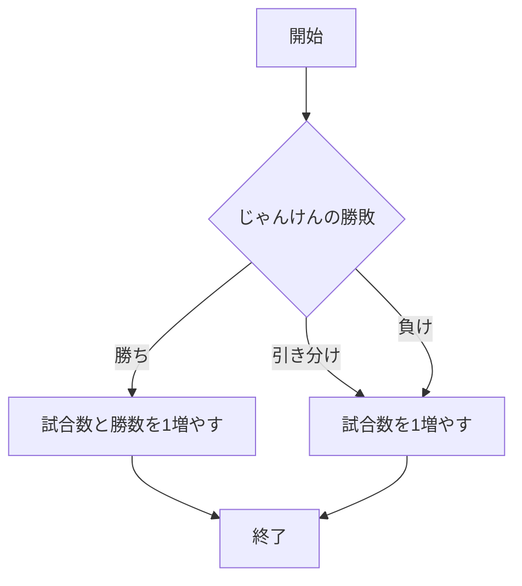
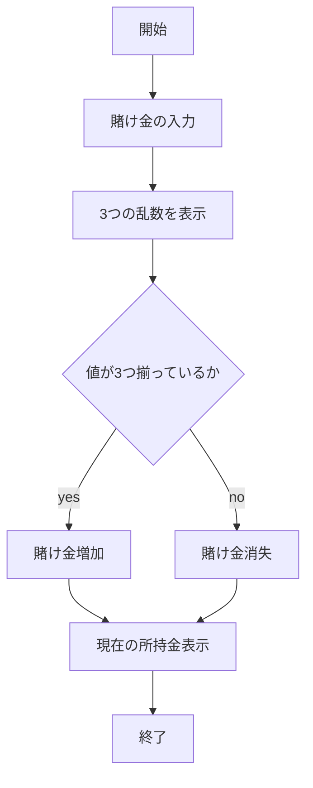
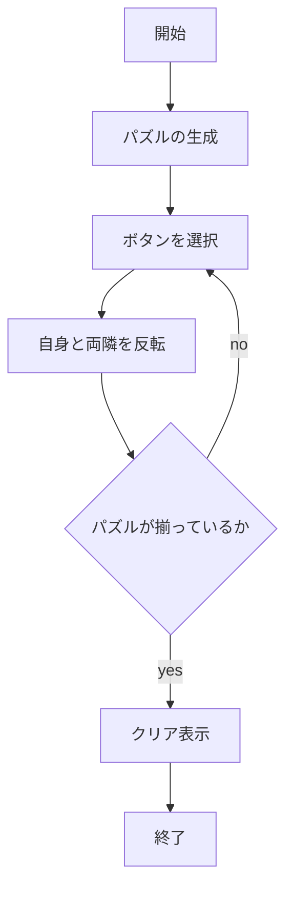

# webpro_06

## GitHubでの管理について
Gitで管理する際，誰が変更したか明らかにするため，
ユーザ名とメールアドレスを登録する．
この作業は1回だけ実行しておけば良い．
以下の例は「鈴木涼斗」がユーザ名とメールアドレスを
登録する例である．各自の情報に合わせて実行する．
```
$ git config --global user.name "Suzuki Ryoto"
$ git config --global user.email "suzuki@ryoto.co.jp"
```
GitHubに修正，追加したファイルをアップロードしたい場合，次のコマンドをターミナルで実行する．
なお，'コメント'の部分は変更理由や変更内容を書くためにあるためそのままにしない．
```javascript
git add .
git commit -am 'コメント'
git push
```

## サーバーの起動について
起動したいサーバーのプログラムが書かれているファイルがあるディレクトリで以下のように実行する．
例として今回起動するファイルを「app.js」とする．
```javascript
node app.js
```

## じゃんけん
### このプログラムについて
このプログラムは，「グー，チョキ，パー」のいずれかを入力すると，コンピュータ側がランダムで出した手との勝敗を判定するプログラムである．勝敗の判定の他に試合数，勝利数をカウントする機能がある
### ファイル一覧
ファイル名 | 説明
-|-
app5.js | プログラム本体
public/janken.html | じゃんけんの開始画面
views/janken.ejs | 画面のテンプレート

### 利用手順
1. ```app5.js```を起動する
1. Webブラウザでlocalhost:8080/public/jankenにアクセスする
1. 自分の手「グー，チョキ，パー」いずれかを入力する
1. 試合数，勝利数をリセットしたいときは，「リセット」と入力する
1. 送信を押す

## スロット
### このプログラムについて
このプログラムは，コインを賭け，ランダムに生成された3つの数字が揃えばコインが増え，揃わなければコインが減る，スロットゲームを再現したものである．詳細は，数字が揃えば賭けたコインが10倍になり，揃わなければ賭けたコインがなくなるという機能である．
### ファイル一覧
app5.js | プログラム本体
public/slot.html | スロットの開始画面
views/slot.ejs | 画面のテンプレート
### 利用手順
1. ```app5.js```を起動する
1. Webブラウザでlocalhost:8080/public/slotにアクセスする
1. 賭けるコインの枚数を入力する
1. 送信を押す
1. リセットしたい場合は「リセット」と書かれているボタンを押す


## パズル
### このプログラムについて
このプログラムは，ランダムで生成された5つの◯か☓のボタンを押してマークを揃えるパズルゲームである．詳細は，5つのいずれかのボタンを押すと，押したボタンとその両隣のボタンのマークが反転するという機能である．
### ファイル一覧
app5.js | プログラム本体
public/puzzle.html | スロットの開始画面
views/slot.ejs | 画面のテンプレート
### 利用手順
1. ```app5.js```を起動する
1. Webブラウザでlocalhost:8080/public/puzzleにアクセスする
1. 任意のボタンを押す
1. パズルを再生成したい場合は「リセット」と書かれているボタンを押す


## フローチャート

###　じゃんけん



###　スロット



###　パズル

