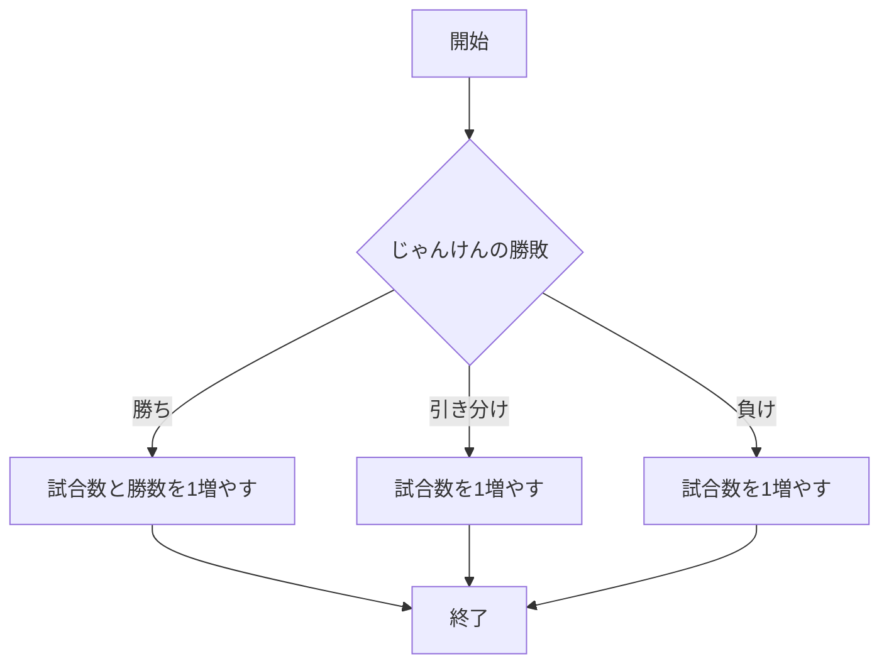

# webpro_06

## GitHubでの管理について
Gitで管理する際，誰が変更したか明らかにするため，
ユーザ名とメールアドレスを登録する．
この作業は1回だけ実行しておけば良い．
以下の例は「鈴木涼斗」がユーザ名とメールアドレスを
登録する例である．各自の情報に合わせて実行する．
```
$ git config --global user.name "Suzuki Ryoto"
$ git config --global user.email "suzuki@ryoto.co.jp"
```
GitHubに修正，追加したファイルをアップロードしたい場合，次のコマンドをターミナルかそれに準じたソフトで実行する．
なお，'コメント'の部分は変更理由や変更内容を書くためにある．
```javascript
git add .
git commit -am 'コメント'
git push
```

## サーバーの起動について


## このプログラムについて

## ファイル一覧
ファイル名 | 説明
-|-
app5.js | プログラム本体
public/janken.html | じゃんけんの開始画面
views/janken.ejs | 画面のテンプレート

```javascript
console.log( 'Hello' );
```

## 利用手順

### じゃんけん
1. ```app5.js```を起動する
1. Webブラウザでlocalhost:8080/public/janken.htmlにアクセスする
1. 自分の手を入力する


## フローチャート

###　じゃんけん




10/28